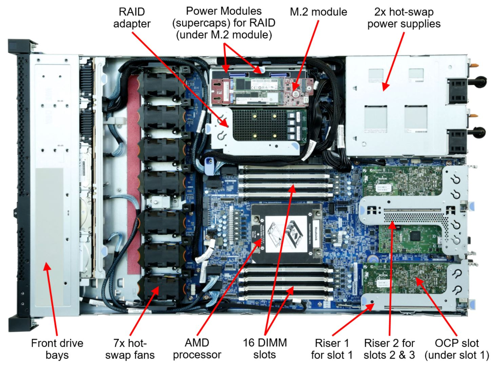

## Software Testing Introduction

1.  

    

    What is <b>Hardware</b>?
    

    

    Hardware is the combination of **equipment that we interact** with, any Computer Equipment we can see and touch is called Computer Hardware.  
    Ex: Mouse, Keyboard, Monitor, Speakers, Microphone, CPU, GPU, etc.

    

    

1.  

    

    What is <b>Software</b>?
    

    

    Software is an abstraction to Hardware, which acts as an **Interface between Human and Machine**.  
    Examples of Software are Operating System, Drivers, Applications, etc.

    

    

1.  

    

    What is <b>Kernel</b>?  
    

    

    The kernel is a piece of code that **translates O.S operations to binary**.  
    generally developed by the Hardware Manufacturers, so the Operating Systems can access the Hardware to their full potential.  
    Operating System should be compatible with specific kernels or the System won't boot.

-   There are two types of kernels **Monolithic**(Windows Kernel) and **Micro**(Linux and Mac).

    

    

1.  

    

    What is an <b>Operating System</b>?
    

    

    An Operating System is an **interface**/medium between **Kernel/Drivers and Application**.

    -   It performs **Kernel operations** that the applications don't have to worry about.
    -   O.S is the most common Software users interact with, applications are **installed on top** of the Operating system.

    Ex: Ubuntu, Debian, Arch Linux, Mac, Windows, Android, Symbian, Firefox O.S, iPhone O.S, etc., are some of Popular Operating Systems.

    

    

1.  

    

    What is a <b>Software Application</b>?
    

    

    A Software application is an interface between Operating System and Human User.  
    We use Various Software Applications to **perform various tasks** with our Computer.

    Ex: Microsoft Word, Games like Crysis, Chrome Browser, VLC Media Player, etc., are some of the most used Software Applications.

    

    

1.  

    

    Who is an <b>End User</b>?
    

    

    An End-user is a Person who **uses the current application**.  
    End-users generally don't care about _how the application is built_ as long as it performs as it advertises.

    If the application or the product doesn't meet the end users/customer's expectation he may stop using the application and switch to a competitor's product or give bad reviews which can affect the companies business.  
    He is the most important part of any business and economy, we are all end users of one or more products in our life.  
    For example, we are end-users of bikes, cars, electricity.

    

      

      

1.  

    

    Who is a <b>Client</b>?
    

    

    A client is a person who **gives requirements** to the software company about what to build and how it should perform.  
    Here the client is a customer of the software company, while the end-user is the customer of the client.

    Ex: Company(Intel)--> Client (Apple)--> Macbook laptops (End user).  
    Here apple asks intel what type of CPU it needs for the laptops then the company builds it, which is then used in apple's business which would be given to end-users as MacBook.  
    If the end-user is satisfied then the client is satisfied and the company will be satisfied too.

    

    

1.  

    

    What does a <b>Software Company</b> do?
    

    

    A software company **builds software** for its customers or clients.  
    Depending on the domain of the software company different clients approach the company for different software products to be built.

    Ex: The client wants to expand his dental care to multiple locations.  
    And needs software that makes it easier for the patients or end-users to check whether the doctor is available in the current branch.  
    He approaches a software company and gives them the requirement, the company builds an application and gives it to the doctor.  
    This product is given to all patients of the doctor, this helps in expanding his business.

    

    

1.  

    

    What is a <b>Domain</b>?
    

    

    A domain is the **categorization of the software industry**.  
    Depending on the product the software company builds it falls under one or more domains.  
    Ex: Health care, gaming, finance, Entertainment are some of the growing Domains in India.

    Infosys is famous for the finance domain but it builds Health care applications also.  
    EA, Gameloft, Epic games work in the Gaming domain but they work with Entertainment applications sometimes.

    

    

1.  

    

    What is a <b>Server</b>?
    

    

    A server is a computer that is used to **take input** from an end-user/application, **process it** and **return a result**.

    We have many servers like

    -   web server
    -   mail server
    -   file server
    -   database server
    -   virtual server
    -   cloud server

    In a software project, we use these 3 servers frequently than others

    -   development server
    -   testing server
    -   production server

    most commonly in the current industry, we either build all our servers manually at a data center or rent servers on cloud platforms.  
    We communicate with each server using their IP address.
    

    

    

1.  

    

    What is a <b>Data center</b>?
    

    

    A Datacenter is a **location** or building that is used **to house multiple servers**.  
    This data center can belong to a single company or multiple companies.

    

    

    

1.  

    

    What is an <b>Environment</b>(in Software)?
    

    

    In Software, Environment refers to the **Hardware and Software needed to run an application** smoothly.

    Ex: Consider youtube, to use it we need a Device, O.S, Browser, Internet then we can use the youtube application.  
    All the above parts combined are called an Environment needed to run youtube.

    

    

1.  

    

    Explain <b>Build</b>?
    

    

    A Build is a **standalone application** which is developed by compiling source code.  
    Before releasing an application to the public the software company creates multiple builds internally.  
    It is so that the development and testing of an application happen simultaneously.  
    While build 2 is being developed, build 1 can be tested.

    The build numbers and release numbers don't have to match, i.e we can make a public release with version 1.0 while our build number maybe 92.7.  
    It is tracked internally and the public doesn't know about the internal build versions, only the public release versions.

    Ex: Before releasing WhatsApp to the general public as version 1.0, there might have been around 1,000 builds internally, starting from build-1.0 till build-1.999.

    

    

1.  

    

    What is a <b>Development Cycle</b>?
    

    

    The **time taken to Develop** a Build from the requirement is called Development Cycle.  
    For each build, a new Development Cycle will start.  
    This is done in Development Server.

    

    

1.  

    

    What is a <b>Test Cycle</b>?
    

    

    The **time taken to Test** one Build completely is called Test Cycle.  
    For each new build, a new Test Cycle will start.  
    This is done in Testing Server.

    

    

1.  

    

    What is a <b>Release Cycle</b>?
    

    

    The **time taken to Develop, Test, Release, and Application** is called Release Cycle.  
    At the end of one Release Cycle, we will get a Final Stable build of the application.  
    The release will be done in the Production Server.

    For each new Version/Release, a new Release Cycle begins.  
    During the One Release cycle, there will be probably from 10 to 1000 Development Cycles and Test Cycles.

    After releasing the product to end-users the client may want new features in the next version or remove some features from the current version.  
    To do all these a new Release Cycle is started, in this case, it will be called the 2nd release cycle.

    Ex: After about 500 development and testing cycles a final stable build of WhatsApp is developed.  
    This is then given to the client, after he is satisfied with the application, it will then be installed in a production server to be available to the end-users as version 1.  
    Any new changes/modifications after releasing version 1 (or) release 1 are made in release 2.

    

    

1.  

    

    Explain about <b>Development Server</b>? 
    

    

    A **Server** which is **used for Development** purposes is called a Development Server.  
    It is usually a private server which can be only accessed by company employees, url is similar to dev.projectname.com.  
    Ex: dev.facebook.com

    
    
    

1.  

    

    What is a <b>Testing Server</b>? 
    

    

    A **Server** which is **used for Testing** purposes is called a Testing Server.  
    It is usually a private server which can be only accessed by company employees, url is similar to test.projectname.com.  
    Ex: test.facebook.com

    
    
    

1.  

    

    What is a <b>Production Server</b>? 
    

    

    A **Server** which is **used by the end-users** daily is called Production Server.  
    It is always a public server which can be accessed by general public.  
    This server contain huge computational and bandwidth resources, compared to dev or test servers.  
    Ex: facebook.com

    
    
    

1.  

    

    Explain in Detail the entire <b>Build process</b> of One <b>Release Cycle</b> or One Version Release?
    

    

    A build is a **standalone application** that can be used and tested for defects.  

    At the beginning of Development, the Client gives requirements to the Software Company in the Form of CRS.  
    These requirements are then divided into small modules to make development easier.  

    After having the entire requirements in form of modules, the **Dev team** will **start developing** the application(modules A, B, C, D).  
    At this time the **testing team** will think and **write scenarios and test cases** for the modules(A, B, C, D) that the dev team is working on.  
    These **Scenarios and Test Cases** Test Engineers write are **stored in** a **Test Repo** like Jira, QC/ALM.  

    - Developers will **write the source code** on laptops or PC's provided by the company.  
    - After performing unit testing manually, they will **commit the code** to a Version Control System.  
      - The most common VCS in 2021 is **Git**.  
    - Once the source code is given to VCS, **automated tasks** in the Development server **kick in**.  
    - These tasks **perform** automated **White Box testing's**.  
    - If all the **test cases pass**, the source **code is compiled**.  
    - This **compiled code is** then **built** to produce a single application **file** and compressed to reduce file size.  
    - The result is a build file that is in either a **.tar**(Tape Archive) or **.jar**(Java Archive) **format**.  
    ---
    - This build file is given to the Testing team after one development cycle is complete(Consider this R01-B01, Release 1 Build 1)  
    - Test Engineers will **install** this **build** file in **Testing Server**.  
    - Now Test Engineers start **executing** the **Test cases** one by one.  
    - Since this is the 1st build of 1st Release **no regression testing is done**.  
    - After executing all the test cases, Test Engineers will **automate** these **test cases for future regression** testing.  
    - If the build contains any defects or the **test cases fail**, the Test Engineer will **raise the defect** to the concerned developer.  
    - After Entire R01-B01 is Tested, Test Engineers will **track the raised defects**.  
    ---
    While Developers are Developing R01-B01, Test Engineers Write Scenarios and Test Cases.  
    While Developers are Developing R01-B02, Test Engineers will test R01-B01.  
    In this time period bugs found in R01-B01 are bought to the Developer's notice and attempt to fix them.  
    These Fixed defects are included in R01-B02, before giving it to Test Engineers.  

    So the **R01-B02** contains **R01-B01 + Bug fixes of R01-B01 + New Features** unique to this build.  

    When Test Engineers get R01-B02 they will first Test the Bug fixes and perform regression Testing, Then they will test all test cases related to new features. 
    After done testing R01-B02 they will create scripts to automate the test cases for future Regression Testing. 
    
    This entire **process** continues **in a loop** until we have all the requirement7------- modules in our build, and have very few bugs preferably zero.  
    This build is called the **final stable build**.  

    This Stable build is **given to the client**, he will perform **User Acceptance Testing** on it. 
    If he is satisfied then he will **approve** the application **for public release**.  
    The build might be **R01-B350**, But to the public, we will rename this as **Version 1.0**.  

    The application is then installed on to Production Server, either by the dev team or test team depending on the company guidelines.  
    After all the needed tools are installed in the production server, the application is ready for public release.  
    After public release, maintenance and monitoring of the application Begin.  
    Data like **logs, analytics, complaints, reports** are collected and **given to client** for improving his business.    

    This entire process is collectively called one **Release Cycle**.  

    Depending on the client requirements, we will start a new release cycle with the last build i.e R01-B350, and add new features or remove old features.  

    From the 2nd Release, we follow the same procedure we did in the 1st Release Cycle with one exception.  
    We **perform regression testing** from the **first build** onwards, as we already have old test cases to perform. 
    The naming also changes from **R01-B350 to R02-B01**. Here R02-B01 contains R01-B350 + new features + Bug fixes. 
    There can be any number of Release Cycles, this depends entirely on the Client Budget and business.  

    Ex: WhatsApp's current public version is 35. It is safe to guess there have been 35 release cycles till now internally.  

    

    
    
    

-   adf
-   sdf

-

1.  

    

    

    

    
    
    

## Software Life Cycles

## Testing Definitions

## ISTQB

## Types of Testing

## Software Testing Intro

   
1. 

   
What is Software Testing? (or) What is the purpose of Software Testing?

   Testing the Functionality of Software Application With respect to Customer requirements is called Software Testing.
   The purpose of Testing is to check whet  her the software application is matching the customer requirements, so we can avoid any defects. 
   

1. 

   
Who Performs Software Testing?

   A Test Engineer with good knowledge on different types of Testing, Performs Software Testing.
   

1. 

   
How to do Software Testing?

   Software Testing is done in two ways, either manually(by hand) or automatically(using a tool).  
   Nowadays we are performing Manual Software Testing on Creative Testing tasks and Automating boring testing tasks.
   

1. Where is Software Testing preferred?
   When we want a Good Quality software for the end users, we want it to be stable and bug free, so we do software testing.

1. Why do we do Software Testing and what happens if we don't?
   To make our application bug-free and stable for the end users, we do Software Testing.  
   If we don't Perform Software Testing then the end users may face some bugs and defects from the application. Which would be negative for the business, and may lose a customer. That's why we do Software Testing.

1. What is Customer Requirement Specification?
   Customer or the client of software Company will give his requirements in the form of CRS also called Customer Requirement Specification.  
   CRS Document contains what software the client wants from the company.

1. Why is CRS called Business Requirement Specification?
   CRS or Customer Requirement Specification is given by client telling what he wants to build and how it should improve his business.  
   Hence it can be considered as a requirement for his business.  
   So CRS is also BRS.

1. Who gives CRS?
   Customer or client gives CRS to Software Company.

1. How is CRS used?
   CRS Contains all the details of what the customer wants from the software company and how it should impact his own business.
   CRS is used to enhance the customers business by creating an application for them.

1. Give a Real Time Example of CRS?
   Ordering a Pizza from a Restaurant is similar to customer saying what he needs from the software company.

1. What is a Defect?
   A Deviation found in Application With respect to customer requirement is called Defect. It is a Formal name used by Test Engineers.

1. What is a Bug?
   A Defect which is found by Test engineer and Accepted by Developer is called a Bug. It is an Informal name used by Developers.

1. What is a Error?
   An Error is a Mistake done by Developer in Source Code of the Application.  
   Ex: A java compiler error.

1. What is a Issue?
   An Issue is a Bug/Defect found by the end users of the application.
   Ex: A bug in whatsapp where the end users can't send messages is an issue.

1. What is a Failure?
   When the end user faces multiple issues in the application, then the application becomes unusable. This is called failure.

What is a Manual Testing?
Testing the functionality of the application without using any tool is called manual testing.

What is Automation Testing?
Testing the Functionality of the application using a tool is called automation testing.

What is White box Testing?
Testing the source code of the application is called white box testing. done by developers.

What is Black Box Testing?
Testing the GUI of the application is called black box testing. done by test engineers.

What is Grey box testing?
Testing both the source code and gui of the application is called grey box testing. done by software developer engineer and tester.

Difference Between White Box Testing and Black Box Testing?

| White Box Testing                                      | Black Box Testing                                     |
| ------------------------------------------------------ | ----------------------------------------------------- |
| Done on source code of application                     | Done on GUI of Application                            |
| Done by Developers                                     | Done by Test Engineers                                |
| Need Good Programming knowledge to do this             | Need good testing knowledge to do this                |
| Need knowledge of internal structure of application    | Need knowledge of external structure of application   |
| Tools like JUNIT,NUNIT,TestNG are used to perform this | Tools like QTP/UFT, Selenium are used to perform this |

## Life Cycles

Explain Software Development Life Cycle?
Explain Software Testing Life Cycle?
Explain Bug Life Cycle (or) Defect Life Cycle?
Name all Methodologies of SDLC? - Waterfall - V & V - Spiral - Prototype - Agile - Dev Ops - Iterative - Lean

## Various Testing Definitions

Explain Build Process of One Release Cycle?
What is a Scenario?
What is a Test Case?
What is a Test Strategy?
What is a Test Plan?
What is a Test Case Template?
What is a Defect Report (or) Bug Report?
What are some tools used for functional Testing?
What are some tools used for Test Management?
What are some tools used for Defect Tracking?
What are some tools used for Performance Testing?
What are some tools used for ?
What is Defect Seeding?
What is Defect Masking?
What is Defect Leakage?
What is Defect Triage Meeting?
What is Defect Density?
What is Latent Defect?
What is HotFix (or) Incident Management System?
What is Fishbone Diagram (or) Ishikawa diagram?
What is a Short Term Release?

## Types of Testing

Give the names of all Testings?

1.  Functional Testing

    1. Component Testing (or) Functional Testing
    2. Integration Testing
        1. Incremental Integration Testing
            1. Top-Down Approach
            2. Bottom-Up Approach
        2. Non-Incremental Integration Testing (or) Big Bang
    3. System Testing
    4. Smoke Testing (or) Confidence Testing
        1. Formal Smoke Testing
        2. Informal Smoke Testing
    5. Sanity Testing
    6. Re-Testing
    7. Regression Testing
        1. Unit Regression Testing
        2. Regional Regression Testing
        3. Full Regression Testing
    8. User Acceptance Testing
        1. Alpha Testing
        2. Beta Testing

2.  Non-Functional Testing

    1. Accessibility Testing
    2. Adhoc Testing
    3. Aesthetic Testing
    4. Compatibility Testing
        1. Browser Compatibility Testing
        2. Hardware Compatibility Testing
        3. Mobile Compatibility Testing
        4. Software Compatibility Testing
    5. Database Testing
    6. Exploratory Testing
    7. Globalization Testing
        1. Internationalization Testing (I18N)
        2. Localization Testing (L10N)
    8. Performance Testing (or) Scalability Testing
        1. Load Testing
        2. Soak Testing
        3. Stress Testing
        4. Volume Testing
    9. Recovery Testing
    10. Reliability Testing
    11. Scalability Testing
    12. Security Testing
        1. Ethical Hacking
        2. Penetration Testing
        3. Risk Assessment
        4. Security Auditing
        5. Security Scanning
        6. Vulnerability Testing
    13. Usability Testing

## ISTQB

What is ISTQB?
Explain Types of Testing in ISTQB?

1.  Static Testing
    1. Review
        1. Self Review
        2. Peer-Peer Review
        3. Manager Review
    2. Walkthrough
    3. inspection
        1. CMMI
2.  Dynamic Testing

    1. White Box Testing Techniques
        1. Statement Coverage Testing
        2. Branch Coverage Testing
        3. Path Coverage Testing
        4. Cyclomatic Complexity
    2. Black Box Testing Techniques 1. Boundary Value Analysis Technique 2. Equivalence Partitioning Technique 3. Error Guessing Technique 4. Decision Table Technique 5. State Transition Technique 6. Use Case Technique
       What are principles of Software testing ?

3.  Who finds a Defect?
4.  Where does a Defect Appears?
5.  How to resolve a Defect?
6.  Why does a Defect occurs?
7.  Give a Real Time Example of Defect
8.  What is a Bug?
9.  How to find and resolve a Bug?
10. Why does a Bug Appear?
11. Where does a Bug Occur?
12. When can a Bug appear?
13. Who should find and resolve a Bug?
14. Give a Real Time Example of Bug?
15. What is a Error?
16. How to Find Errors and Resolve Them?
17. Why do we find Errors?
18. Where do you find Errors?
19. When can Errors Occur?
20. Who should find and resolve Errors?
21. Give a Real Time Example of Error?
22. What Is an Issue and Failure?
23. How to Identify and resolve Issues and Failures?
24. Why do Issues and Failures Occur?
25. Where do you find Issues and Failures?
26. When Can Issues and Failures Raise?
27. Who Should Find and Fix issues and Failures?
28. Give a Real Time Example of an Issue and Failure?
29. What are the Roles and Responsibilities of Software Developer?
30. How should Software Developer interact with a Test Engineer?
31. Why do Software Developers are needed?
32. Where do Software Developers Skills are needed?
33. When do we need a Software Developer and when we don't need one?
34. Who is a Good Software Developer?
35. How can you become a Good Software Developer?
36. What are the roles and Responsibilities of a Test Engineer?
37. How should a Test Engineer interact with a Software Developer?
38. Why do we need Test Engineers?
39. Where do we need Test Engineer Skills?
40. When do we need a Test Engineer and When we don't need one?
41. Who is a Good Test Engineer?
42. How can you become a Good Test Engineer?
43. What is Manual Testing and Automation Testing?
44. How do we perform Manual Testing and Automation Testing?
45. Why do we do Automation testing when we have Manual Testing?
46. Where can we use Manual and Automation Testing?
47. When do we prefer Manual over Automation and why?
48. Who takes care of Manual Testing and Automation Testing?
49. Give a Real Time Example of Manual Testing and Automation Testing?
50. What are the types of Testings?
51. How did we divide types of Testing?
52. Why do we need different types of Testing?
53. Where do we different types of Testing?
54. When do we go for different types of Testing?
55. Who should perform these Testings?
56. Give a Real Time Example of some types of Testings?
57. What is White Box Testing?
58. How do we do White Box Testing?
59. Why do we do White box Testing?
60. Where can we do White Box Testing?
61. When do we need White Box Testing?
62. Who performs White box Testing?
63. Give a Real Time Example of White Box Testing?
64. What is Black Box Testing?
65. How do we do Black Box Testing?
66. Why do we do Black box Testing?
67. Where can we do Black Box Testing?
68. When do we need Black Box Testing?
69. Who performs Black box Testing?
70. Give a Real Time Example of Black Box Testing?
71. What is UI and GUI?
72. How do we Create a Good UI and Good GUI?
73. Why do we need UI or GUI?
74. Where can you use UI over GUI and GUI over UI?
75. When do we use UI and GUI?
76. Who creates Good UI and Good GUI?
77. Give a Real Time Example of UI and GUI?
78. What are the Differences Between White Box and Black Box Testing?
79. What is Functional Testing?
80. How do we do Functional Testing?
81. Why do we need Functional Testing?
82. Where do we perform Functional Testing?
83. When do we do Functional Testing?
84. Who performs Functional Testing?
85. Give a Real Time Example of Functional Testing?
86.     What is Integration Testing?
87.     How do we do Integration Testing?
88.     Why do we need Integration Testing?
89.     Where do we perform Integration Testing?
90.     When do we do Integration Testing?
91.     Who performs Integration Testing?
92.     Give a Real Time Example of Integration Testing?
93.     What is System Testing?
94.     How do we do System Testing?
95.     Why do we need System Testing?
96.     Where do we perform System Testing?
97.     When do we do System Testing?
98.     Who performs System Testing?
99.     Give a Real Time Example of System Testing?
100.                          What is Retesting?
101.                          How do we do Retesting?
102.    Why do we need Retesting?
103.    Where do we perform Retesting?
104.    When do we do Retesting?
105.    Who performs Retesting?
106.    Give a Real Time Example of Retesting?
107.    What is Regression Testing?
108.    How do we do Regression Testing?
109.    Why do we need Regression Testing?
110.    Where do we do Regression Testing?
111.    When do we perform Regression Testing?
112.    Who perform regression Testing?
113.    Give a Real Time Example of Regression Testing?
114.    What is Smoke Testing?
115.    How do we do Smoke Testing?
116.    Why do we need Smoke Testing?
117.    Where do we do Smoke Testing?
118.    When do we perform Smoke Testing?
119.    Who perform Smoke Testing?
120.    Give a Real Time Example of Smoke Testing?
121.    What is Sanity Testing?
122.    How do we do Sanity Testing?
123.    Why do we need Sanity Testing?
124.    Where do we do Sanity Testing?
125.    When do we perform Sanity Testing?
126.    Who perform Sanity Testing?
127.    Give a Real Time Example of Sanity Testing?
128.    What is Adhoc Testing?
129.    How do we do Adhoc Testing?
130.    Why do we need Adhoc Testing?
131.    Where do we do Adhoc Testing?
132.    When do we perform Adhoc Testing?
133.    Who perform Adhoc Testing?
134.    Give a Real Time Example of Adhoc Testing?
135.    What is Exploratory Testing?
136.    How do we do Exploratory Testing?
137.    Why do we need Exploratory Testing?
138.    Where do we do Exploratory Testing?
139.    When do we perform Exploratory Testing?
140.    Who perform Exploratory Testing?
141.    Give a Real Time Example of Exploratory Testing?
142.    What is Performance Testing?
143.    How do we do Performance Testing?
144.    Why do we need Performance Testing?
145.    Where do we do Performance Testing?
146.    When do we perform Performance Testing?
147.    Who perform Performance Testing?
148.    Give a Real Time Example of Performance Testing?
149.    What is Compatibility Testing?
150.    How do we do Compatibility Testing?
151.    Why do we need Compatibility Testing?
152.    Where do we do Compatibility Testing?
153.    When do we perform Compatibility Testing?
154.    Who perform Compatibility Testing?
155.    Give a Real Time Example of Compatibility Testing?
156.    What is Globalization Testing?
157.    How do we do Globalization Testing?
158.    Why do we need Globalization Testing?
159.    Where do we do Globalization Testing?
160.    When do we perform Globalization Testing?
161.    Who perform Globalization Testing?
162.    Give a Real Time Example of Globalization Testing?
163.    What is Usability Testing?
164.    How do we do Usability Testing?
165.    Why do we need Usability Testing?
166.    Where do we do Usability Testing?
167.    When do we perform Usability Testing?
168.    Who perform Usability Testing?
169.    Give a Real Time Example of Usability Testing?
170.    What is Reliability Testing?
171.    How do we do Reliability Testing?
172.    Why do we need Reliability Testing?
173.    Where do we do Reliability Testing?
174.    When do we perform Reliability Testing?
175.    Who perform Reliability Testing?
176.    Give a Real Time Example of Reliability Testing?
177.    What is Accessibility Testing?
178.    How do we do Accessibility Testing?
179.    Why do we need Accessibility Testing?
180.    Where do we do Accessibility Testing?
181.    When do we perform Accessibility Testing?
182.    Who perform Accessibility Testing?
183.    Give a Real Time Example of Accessibility Testing?
184.    What is Acceptance Testing?
185.    How do we do Acceptance Testing?
186.    Why do we need Acceptance Testing?
187.    Where do we do Acceptance Testing?
188.    When do we perform Acceptance Testing?
189.    Who perform Acceptance Testing?
190.    Give a Real Time Example of Acceptance Testing?
191.    What is a Domain?
192.    How do we know something is a Domain?
193.    Why do we need many Domains?
194.    Where are some Domain going in future, name some?
195.    When do new domains arise?
196.    Who categorizes the domain?
197.    Give a Real Time Example of a Domain?
198.    What is SDLC?
199.    How SDLC works?
200.    Why was SDLC invented?
201.    Where we use SDLC?
202.    When do prefer SDLC?
203.    Who uses SDLC the most?
204.    Give a Real Time Example of SDLC?
205.    What is STLC?
206.    How STLC works?
207.    Why was STLC invented?
208.    Where we use STLC?
209.    When do prefer STLC?
210.    Who uses STLC the most?
211.    Give a Real Time Example of STLC?
212.    What is DLC(Defect Life Cycle)?
213.    How DLC(Defect Life Cycle) works?
214.    Why was DLC(Defect Life Cycle) invented?
215.    Where we use DLC(Defect Life Cycle)?
216.    When do prefer DLC(Defect Life Cycle)?
217.    Who uses DLC(Defect Life Cycle) the most?
218.    Give a Real Time Example of DLC(Defect Life Cycle)?
219.    What is WaterFall?
220.    How do we use WaterFall?
221.    Why should we prefer Water Fall over others?
222.    Where can we use WaterFall?
223.    When do we use WaterFall Model over others?
224.    Who is WaterFall Beneficial too?
225.    Give a Real Time Example of Water Fall Model?
226.    What is Spiral?
227.    How do we use Spiral?
228.    Why should we prefer Spiral over others?
229.    Where can we use Spiral?
230.    When do we use Spiral Model over others?
231.    Who is Spiral Beneficial too?
232.    Give a Real Time Example of Spiral Model?
233.    What is V&V?
234.    How do we use V&V?
235.    Why should we prefer V&V over others?
236.    Where can we use V&V?
237.    When do we use V&V Model over others?
238.    Who is V&V Beneficial too?
239.    Give a Real Time Example of V&V Model?
240.    What is Prototype?
241.    How do we use Prototype?
242.    Why should we prefer Prototype over others?
243.    Where can we use Prototype?
244.    When do we use Prototype Model over others?
245.    Who is Prototype Beneficial too?
246.    Give a Real Time Example of Prototype Model?
247.    What is Agile?
248.    How do we use Agile?
249.    Why should we prefer Agile over others?
250.    Where can we use Agile?
251.    When do we use Agile Model over others?
252.    Who is Agile Beneficial too?
253.    Give a Real Time Example of Agile Model?
254.    What are Various Types of Agile?
255.    Why Scrum is Popular Compared to Other Variants?

**Questions**

1. Difference Between Function and Non-Functional Testing?
2. Difference Between Static & Dynamic Testing?
3. What is Acceptance Testing?
4. What is Alpha & Beta Testing?
5. What is a Test Plan? Explain Attributes & Sections?
6. Explain Test Case Template?
7. Explain Defect Report?
8. Difference Between Test Plan & Test Strategy?
9. Explain Modes of SDLC?
10. Differencese BEtween Waterfall,Spiral,Verification & Validation, Prototype,Agile?
11. Why did you choose this field?
12. Why are you interested in software?
13. Why should i hire you?
14. What is your strength and weakness?
15. Where do you see yourself in 5 years?
16. How much do you rate yourself and why?
17. All STLC Models?
18. What is Defect or Bug life cycle?
19. Scenarios for real world objects?
20. Scenarios for software application?
21. Retesting vs Regression Testing?
22. What is White Box Testing, Grey Box Testing, Black Box Testing?
23. What is use of Testing and Why is it important?
24. Difference Between Scenario & Test Case?
25. Severity & Priority of a defect?
26. Black Box Testing Techniques?
27. Boundary Value Analysis, Equivalence Partioning Guessing
28. Explain Functional Testing, Integration Testing, System Testing?
29. Smoke Testing vs Sanity Testing?
30. Ad-hoc Testing vs Exploratory Testing?
31. Compatability Testing vs Performance Testing?
32. Globalization Testing
33. Usability Testing
34. Accessibility Testing

| Smoke Testing                             | Sanity Testing                                     |
| ----------------------------------------- | -------------------------------------------------- |
| Testing the Basic Features of Application | Testing the new features and bug fixes             |
| We perform shallow and wide testing       | here we perform narrow and deep testing            |
| Performed on unstable builds              | performed on stable builds                         |
| only positive test cases are executed     | both positive and negative test cases are executed |
| This is a standalone procedure            | subset of regression testing                       |

| Formal Smoke Testing                     | Informal Smoke Testing                             |
| ---------------------------------------- | -------------------------------------------------- |
| Here we have Documented Test cases       | We don't have any documentation about testcases    |
| We have Proof of defects                 | we won't have proof of defects                     |
| A procedure is followed while doing this | there is no proper procedure while performing this |

| Quality Assurance(Verification)                               | Quality Control(Validation)                                   |
| ------------------------------------------------------------- | ------------------------------------------------------------- |
| QA is process oriented                                        | QC is product oriented                                        |
| a promise is made that required quality is achieved           | QC focus on achieving the promised quality                    |
| QA aims to prevent defects                                    | QC aims to identify and resolve defects                       |
| It also called as Quality Verification                        | It also called as Quality Validation                          |
| This is achieved by monitoring,logging,meetings,communication | This is achieved by executing,testing,fixing,building product |
| We don't execute Programs in this phase                       | We execute programs in this phase                             |
| It is a preventive technique                                  | It is a corrective technique                                  |

| Developer                               | Test Engineer                                                          |
| --------------------------------------- | ---------------------------------------------------------------------- |
| Needs Logical Thinking                  | Needs Creative and out of the box Thinking                             |
| Builds an application                   | Breaks an application so others can't                                  |
| Thinks in positive and ideal situations | Thinks in both positive(ideal) and negative(real/non-ideal) situations |

| SDLC                                                                                                  | STLC                                                                                                                                                                           |
| ----------------------------------------------------------------------------------------------------- | ------------------------------------------------------------------------------------------------------------------------------------------------------------------------------ |
| This is a procedure to develop software applications                                                  | This is a procedure to test a software application                                                                                                                             |
| Contains phases like requirement gathering,feasible study,design,coding,testing,deploying,maintenance | Contains phases like system study,test plan,test cases,prepare requirement traceability matrix ,execution of test cases,defect tracking,Execution report,retrospective meeting |
| Used for whole project                                                                                | Used only for testing phase                                                                                                                                                    |
| It is a whole large process                                                                           | Testing is part of development                                                                                                                                                 |

| Scenario                                | Test Case                                    |
| --------------------------------------- | -------------------------------------------- |
| Scenario is a high level concept        | test case is a detailed concept              |
| Scenario defines on what to test        | test case defines how to test                |
| Can work with overview of steps         | needs details steps on how to test           |
| no navigational steps needed            | navigational steps are needed                |
| takes less time to write                | takes a lot of time to write                 |
| takes more time to think                | takes less time to think                     |
| doesn't provide where the defect raises | provides details on which step defect raises |
| provides all situations to test an app  | gives step by step procedure to test an app  |

| retesting                                                                                           | regression                                                                                                                                                                                                                                                                                                                                                                                                                                                                                    |
| --------------------------------------------------------------------------------------------------- | --------------------------------------------------------------------------------------------------------------------------------------------------------------------------------------------------------------------------------------------------------------------------------------------------------------------------------------------------------------------------------------------------------------------------------------------------------------------------------------------- |
| verifying that defects in previous build are fixed, once fixed those defects should not occur again | regression is checking the impact of a bug fix on related modules, fixing one bug can raise defects in other modules                                                                                                                                                                                                                                                                                                                                                                          |
| we perform this from 2nd build onwards                                                              | we perform this from 2nd build onwards                                                                                                                                                                                                                                                                                                                                                                                                                                                        |
| retesting is a manual proceses                                                                      | regression is a automated process                                                                                                                                                                                                                                                                                                                                                                                                                                                             |
| we perform new test cases on each new build                                                         | we perform same test cases on all builds                                                                                                                                                                                                                                                                                                                                                                                                                                                      |
| we check for previous defects and new defects in latest build                                       | we only check previous defects from build 1 to latest build                                                                                                                                                                                                                                                                                                                                                                                                                                   |
| both retesting and regression works this way                                                        | first developer gives a build to test, test engineers find some defects and raises them to dev team, they fix these defects and add new features in build 2, developers then first retest for build 1 defects and automate that afterwards, then perform normal testing on new features, from build 3 onwards they only test and retest for defects compared to previous build, but they still need to check for defects from build 1 and build 2 this is done by regression through selenium |

| severity                                                                                                     | priority                                                                                                                     |
| ------------------------------------------------------------------------------------------------------------ | ---------------------------------------------------------------------------------------------------------------------------- |
| severity tells on how much the defect affects the customer business                                          | priority gives the developer the order in which defects should be fixed                                                      |
| their are 5 types and depending on company they can call or increase these types in different ways           | depending on company this can any thing from numerics to movie names                                                         |
| blocker defect is the most severe and critical defect this should be fixed asap or the business may shutdown | High priority defect needs to be fixed asap                                                                                  |
| the levels are blocker(showstopper),critical,major,minor,trivial(small defect)                               | high,medium,low are the types of defects, defects should be fixed asap or they may leak to other defects and cause even more |
| severity deals with client business                                                                          | priority deals with developer working time line                                                                              |

| release cycle                                                                                             | test cycle                                                                      |
| --------------------------------------------------------------------------------------------------------- | ------------------------------------------------------------------------------- |
| the time to gather requirements,build and test, release the application to end users is one release cycle | time taken to test one build and raise all defect found in it is one test cycle |
| their can multiple release cycles                                                                         | their are multiple test cycles in one release cycle                             |
| at the end each release cycle a stable version is given to public for using                               | at end of each test cycle a stable build arises                                 |

| ad-hoc testing                                                                                                        | exploratory testing                                                                                                                                                                        |
| --------------------------------------------------------------------------------------------------------------------- | ------------------------------------------------------------------------------------------------------------------------------------------------------------------------------------------ |
| testing an app randomly without any formal procedure or documentation is adhoc testing                                | testing the application without the requirement is exploratory testing                                                                                                                     |
| this is exact opposite to smoke testing                                                                               | here we perform testing in a systematic way since we don't know the requirement                                                                                                            |
| ad-hoc testing is mostly preferred by games due to various types of situations use can play the game                  | this is preformed to find situations that are quite extreme and are only used by 5% of end users                                                                                           |
| not all bugs in adhoc testing need to be fixed unless it is a critical one or the client specifically requests for it | misunderstanding can happen while developing and testing in exploratory proceses, since both teams thinks their point of view is correct, good communication can resolve this quite easily |

| test strategy                                                                                                    | test plan                                                                                                                                                    |
| ---------------------------------------------------------------------------------------------------------------- | ------------------------------------------------------------------------------------------------------------------------------------------------------------ |
| test strategy is choosing one of the multiple possible approaches to solving a problem or testing an application | Test plan is the detailed guide on how to achieve or fulfill the strategy                                                                                    |
| for example deciding on the way of transportation is a strategy, choosing between bus,train,car                  | planning to fulfill the strategy example planning the departure packing bags,people to go,time to travel,reststops are the details we take care in test plan |

| STUB                                                                                                                   | driver                                                                                                                     |
| ---------------------------------------------------------------------------------------------------------------------- | -------------------------------------------------------------------------------------------------------------------------- |
| a stub is a dummy child module used to perform integration testing when the real child module is not ready for testing | a driver is a dummy parent module used to perform integration testing when the real parent module is not ready for testing |
| stub is used until real child module is available                                                                      | driver is used to until real parent module is available                                                                    |
| stub should perform similar operations like a real child module                                                        | driver should perform similar to real parent module                                                                        |
| both stubs and drivers are not shipped to end user or client, they are only used in testing environment                |                                                                                                                            |
| used to test real parent module                                                                                        | used to test real child module                                                                                             |
| used in top down approach                                                                                              | used in bottom up approach                                                                                                 |

| alpha testing                                                                           | beta testing                                                                       |
| --------------------------------------------------------------------------------------- | ---------------------------------------------------------------------------------- |
| alpha testing is testing the application inside our company in a controlled environment | beta testing is done in client company or by end users in uncontrolled environment |
| we can fix bugs in alpha testing faster                                                 | it takes time to fix bugs in beta testing                                          |
| performed by internal test engineers                                                    | performed by clients and end users                                                 |
| performed by developers at development site                                             | performed by client at client location(onsite)                                     |
| performs both white and black box testing                                               | performs only black box testing                                                    |
| done in virtual environment                                                             | done in real environment                                                           |
| done at offshore                                                                        | done at on site                                                                    |

# Guide

1. What is Software Testing?

Testing the Software Application to find any defects that can cause problems and issues to the client and end users, is Software Testing.

2. What is a Requirement?
   The detailed Needs and wants of the customer/client given to the software company for an application development is called requirement of the application

3. What is the role of BA?
   BA or Business Analyst is the Software Company representative that the client interacts with. He is the bridge between company and client. He collets the Customer requirements in the form of Customer Requirement Specification(CRS) or Business requirement Specification(BRS).
   He then translates it to System Requirement Specification for the company to work on and understand.
   He should be good in communication and people skills, he should be nice to customer as he is the one providing the project for the company if the client has any doubts or compliant ba should be available to provide assistance

What is a Defect?
The deviation of the software application from the given requirement with respect to features is a defect
This is a formal name used by test engineers.

what is a bug?
The defect which is accepted by the developer and agrees to fix is called a bug, this is an informal name of the defect.

what are types of defects?
There can be two types of bugs front end related to ui or look of the application or backend processing or working of the application.

example of types of defects?
a button not pressing is related to the working/backend of the application, an image is not displaying in right color or all buttons are overlapping on each other is look or front end defect of the application.

what is an error?
error is a mistake done by the developer in source code

how to fix errors?
by following good coding standards and writing clean and maintainable code base, understanding the compiler or interpreter error messages and preventing them in future.

what is an issue?
Issue is a problem faced by the client or end user after product went into production

what is a failure?
multiple issues faced by end user can lead to a failure. It is best to reduce failures or may lose a customer.

Difference between QA and QC?
QA Stands for Quality Assurance. QC stands for Quality Control.
QA is also called as Verification Process. QC is a validateion Process.
If QA is good a good QC can be Expected.
If QC is good that means a good QA is present.

What is Domain?
Domain is the Categorization of Software applications and software companies depending on the product they develop and the field that product is being used in.

Give Some examples of Domain?
E-Commerce: Amazon, Flipkart
Gaming: EA, Epic, Ubisoft, Gameloft
Social Media: Facebook, Instagram, Twitter.
Entertainment: youtube, netflix, OTT
Banking Domain: ICICI,SBI,HDFC
Financial Services: Share market
HealthCare: Apollo Hospitals
Telecom: Jio, Airtel
Education: Byjuu's, Udemy

Why testing is required?
Every application and product in the world was build for a specific purpose, but that doesn't necessarily translate to it being used only for that purpose. So sometimes that application or product can show some defects and bugs that the end user may not except to face until a situation rises. If it happens in a critical situtation the consequences can be little to life threatning.
So to make sure these situations won't rise we test our product with the end user in mind.
If we find the defects before the end user finds and faces them, we can fix them saving lot of trouble for the end user and lot of negative press of the company.

Give an example of product not tested?
The best example was note 7 explosions it was given the best battery and fast charging for the generation.
but the end users charged it with one go which raised the heating issues to critical point and the battery chemicals expanded to explode completely, which resulted in lot of bad press and share price drop for the company.
Which got so out of hand even after fixing the issue customers didn't buy that modle and hesitated to buy the next model note 8.

Exploratory Testing: In Exploratory Testing we find various scenarios by exploring our application and find defects.

QA: QA stands for Quality Assurance, in this the software company promises the client that a good quality product is delivered to them by following good industry standards and methodologies.
QC: QC stands for Quality Control, in this the Software company works to deliver their promise by following good coding and testing guidelines and making sure the product is bug free and stable.

| QA                                                                                                                                               | QC                                                                                                                                                                 |
| ------------------------------------------------------------------------------------------------------------------------------------------------ | ------------------------------------------------------------------------------------------------------------------------------------------------------------------ |
| QA Stands for Quality Assurance                                                                                                                  | QC stands for Quality Control                                                                                                                                      |
| In QA software Compnay promises the customer that a good quality end product is delivered by following good industry standards and methodologies | In QC Software Company works to deliver the promise by following effective coding and testing guidelines and principles, and making a bug free, stable application |
| QA tries to prevent defects                                                                                                                      | QC tries to find and fix the defects                                                                                                                               |
| QA is a preventive Method                                                                                                                        | QC is a corrective method                                                                                                                                          |
| QA aims to verify the product                                                                                                                    | QC aims to validate the product                                                                                                                                    |
| In QA No program execution is done                                                                                                               | In QC program execution is done                                                                                                                                    |

 

 
Answer

 

